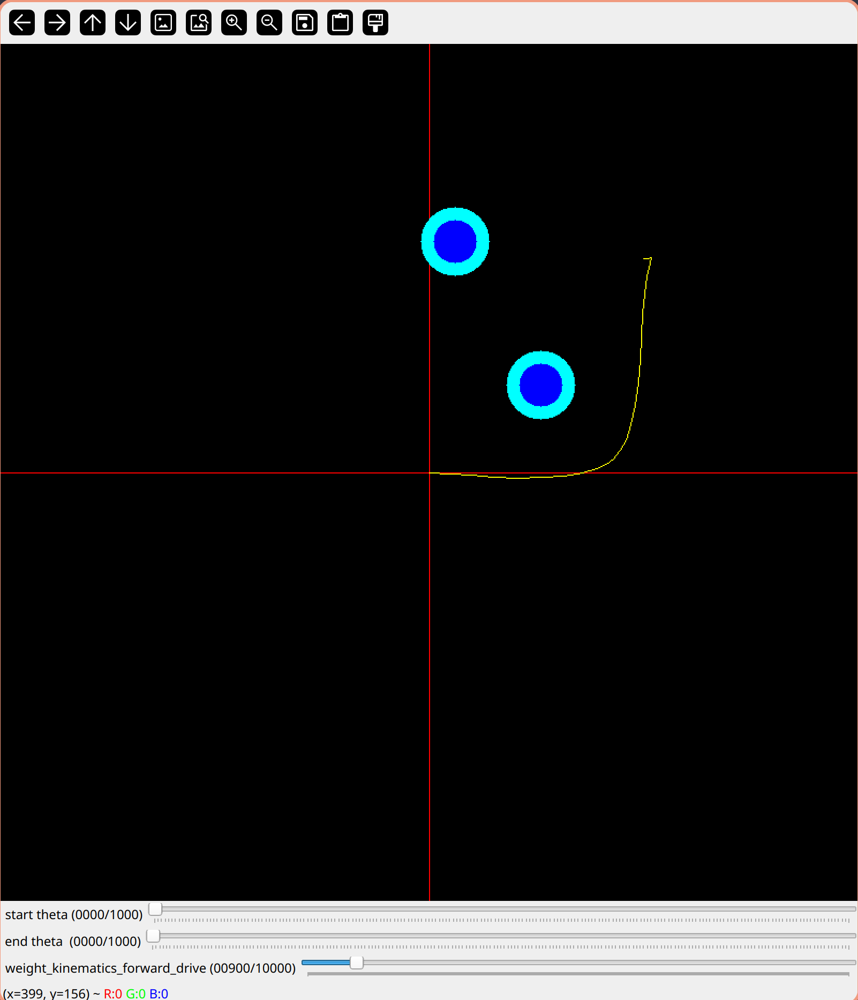
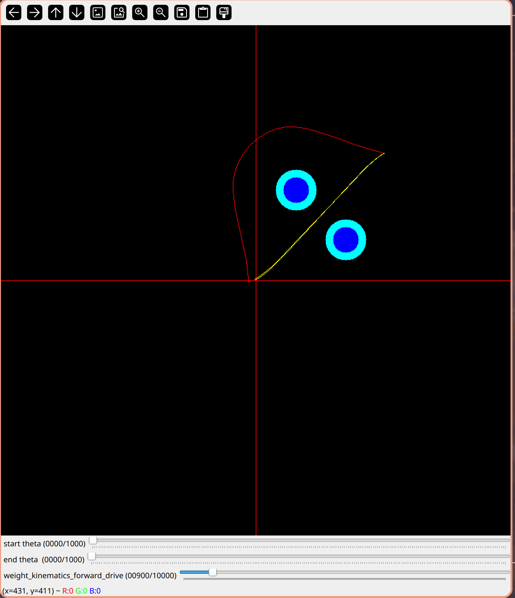

# teb_local_planner

Transplanted the official teb source code to achieve common optimization and multi-path optimization.

Refer to the ros source code for transplantation.

Which can run without the ros framework and use opencv for displaying.

And replace g2o with ceres-solver by google for single path optimization.





## Dependence

- C++17 compiler (tested on gcc 9.1 and gcc 13.2)
- yaml-cpp (0.7.0)
- Eigen3 3.4
- Boost 1.81
- g2o (2020-04 version important!)
- ceres-solver 2.1.0
- OPENCV (4.8.0)

My operating system is archlinux. Also tested on ubuntu 20.04 in docker.


## How to use

```bash
mkdir build
cd build
cmake ..
make -j16
./teb
```

All configurations are in the file config.yaml 

- If compile reports a lot errors because of g2o then you need check your g2o version and if cmake find the g2o correctly.
- If opencv throw error that cannot use `createButton` then you can set `show_button : false` in file `config.yaml`.

If you have other problems, check out your libs version.

## Development

- [x] Remove ros dependence and framework.

- [x] Add opencv displaying.

- [x] Replace g2o with ceres-solver. (Only support single_path and add partial redisual.)

- [ ] Support multi-path optimization with ceres-solver.


## Reference

> 
> Paper:
> 
> 
> Code :
> 
> https://github.com/rst-tu-dortmund/teb_local_planner
> 
> https://github.com/linyicheng1/teb_local_planner
> 
